# LiveNews AI Assistant - System Workflow Diagram

## Complete System Architecture

```mermaid
graph TD
    %% User Layer
    U[👤 User] --> HP[🏠 Main Page]
    U --> AD[📄 Article Detail]
    U --> CH[💬 Chat Interface]
    
    %% Frontend Layer
    HP --> FL[⚡ Flask App<br/>enhanced_flask_app.py]
    AD --> FL
    CH --> FL
    
    %% Flask Routes
    FL --> R1[📍 Route: /]
    FL --> R2[📍 Route: /article/&lt;id&gt;]
    FL --> R3[📍 Route: /api/chat]
    FL --> R4[📍 Route: /api/search]
    
    %% Data Sources
    R1 --> SA[📊 Sample Articles<br/>get_sample_articles()]
    R2 --> SA
    R4 --> SA
    
    SA --> DB[(🗄️ PostgreSQL<br/>Database)]
    SA --> HC[📝 Hardcoded Data<br/>30+ Sample Articles]
    
    %% Templates
    R1 --> T1[📄 enhanced_main.html<br/>3-Column Grid Layout]
    R2 --> T2[📄 article_detail.html<br/>Dark Theme UI]
    
    %% AI Components
    R3 --> AI[🤖 AI Chat System]
    AI --> GEM[💎 Gemini 2.0 Flash<br/>google.generativeai]
    AI --> HCR[📋 Hardcoded Responses<br/>Keyword Matching]
    
    %% Data Processing
    SA --> PROC[⚙️ Data Processing]
    PROC --> SENT[😊 Sentiment Analysis]
    PROC --> FAKE[🛡️ Fake News Detection]
    PROC --> META[📊 Metadata Enhancement]
    
    %% User Interactions
    T1 --> UC1[👆 Click Article]
    T2 --> UC2[💬 Open Chat]
    T2 --> UC3[❤️ Like/Share/Save]
    
    UC1 --> R2
    UC2 --> R3
    
    %% Response Flow
    HCR --> JSON[📤 JSON Response]
    GEM --> JSON
    JSON --> T2
    
    %% Styling
    classDef frontend fill:#e1f5fe,stroke:#01579b,stroke-width:2px
    classDef backend fill:#e8f5e8,stroke:#2e7d32,stroke-width:2px
    classDef data fill:#fff3e0,stroke:#ef6c00,stroke-width:2px
    classDef ai fill:#f3e5f5,stroke:#7b1fa2,stroke-width:2px
    classDef user fill:#ffebee,stroke:#c62828,stroke-width:2px
    
    class U,UC1,UC2,UC3 user
    class HP,AD,CH,T1,T2 frontend
    class FL,R1,R2,R3,R4,PROC backend
    class SA,DB,HC,JSON data
    class AI,GEM,HCR,SENT,FAKE,META ai
```

## Detailed User Journey Flow

```mermaid
sequenceDiagram
    participant U as 👤 User
    participant B as 🌐 Browser
    participant F as ⚡ Flask App
    participant D as 📊 Data Layer
    participant A as 🤖 AI System
    
    %% Main Page Load
    U->>B: Visit website
    B->>F: GET /
    F->>D: get_sample_articles(30)
    D-->>F: Return sample articles
    F->>B: Render enhanced_main.html
    B-->>U: Display 3-column news grid
    
    %% Article Click
    U->>B: Click article
    B->>F: GET /article/1
    F->>D: Find article by ID
    D-->>F: Return article data
    F->>B: Render article_detail.html
    B-->>U: Show article with dark theme
    
    %% Chat Interaction
    U->>B: Click chat button
    B->>B: Toggle chat panel (JavaScript)
    U->>B: Type message
    B->>F: POST /api/chat
    F->>A: Process message
    A->>A: Check keywords
    A-->>F: Return response
    F-->>B: JSON response
    B-->>U: Display AI message
```



## System Components Breakdown


## Key Features & Data Flow

### 1. **News Feed System**
- Sample articles provide consistent demo data
- 3-column responsive grid layout
- Real-time stats dashboard
- Click-through to detailed articles

### 2. **Article Detail System**
- Modern dark theme UI
- Full article content with HTML formatting
- AI insights panel with sentiment analysis
- Action buttons (like, share, save)

### 3. **Chat System**
- Floating chat button (bottom-right)
- Hardcoded keyword-based responses
- Context-aware article discussions
- Smooth animations and interactions

### 4. **Data Consistency**
- Primary: Sample articles (consistent across pages)
- Fallback: PostgreSQL database
- Processing: Sentiment, fake news detection
- Enhancement: AI summaries and insights

### 5. **Technical Stack**
- **Frontend**: HTML5, CSS3, JavaScript
- **Backend**: Flask (Python)
- **AI**: Google Gemini 2.0 Flash
- **Database**: PostgreSQL
- **Styling**: Custom CSS with CSS variables
- **Responsive**: Mobile-first design
