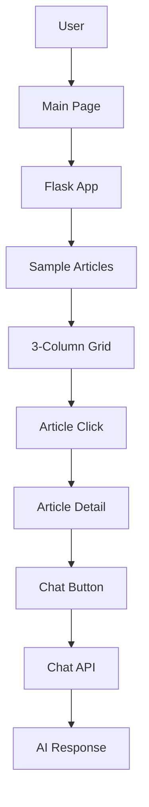

# LiveNews AI Assistant - Workflow Diagram Prompt

## System Overview
Create a comprehensive workflow diagram for the LiveNews AI Assistant system that shows the complete data flow, user interactions, and system components.

## Key Components to Include:

### 1. Frontend Layer
- **Main Page (enhanced_main.html)**: News feed with 3-column grid layout
- **Article Detail Page (article_detail.html)**: Individual article view with dark theme
- **Chat Interface**: Floating chat button and panel
- **User Interface Elements**: Navigation, search, filters

### 2. Backend Layer
- **Flask Application (enhanced_flask_app.py)**: Main web server
- **Routes**:
  - `/` - Main news feed
  - `/article/<id>` - Article detail view
  - `/api/chat` - Chat API endpoint
  - `/api/search` - Search functionality

### 3. Data Sources
- **Sample Articles**: Hardcoded news articles for demo
- **PostgreSQL Database**: Fallback data storage
- **External APIs**: NewsAPI, Gemini AI (optional)

### 4. AI Components
- **Gemini 2.0 Flash**: AI model for chat responses
- **Hardcoded Responses**: Simple keyword-based chat system
- **Sentiment Analysis**: Article sentiment scoring
- **Fake News Detection**: Content credibility checking

### 5. Data Flow
1. User visits main page → Flask serves sample articles → Displays in 3-column grid
2. User clicks article → Flask fetches from samples → Renders article detail page
3. User opens chat → JavaScript toggles chat panel → Sends message to `/api/chat`
4. Backend processes chat → Returns hardcoded response → Displays in chat UI
5. Search functionality → Filters sample articles → Returns results

## Diagram Requirements:

### Visual Elements:
- Use boxes for components
- Arrows for data flow
- Different colors for different layers (Frontend: Blue, Backend: Green, Data: Orange, AI: Purple)
- Include user actions as starting points
- Show both successful and error paths

### Technical Details to Show:
- HTTP requests/responses
- Database connections
- API calls
- File structure relationships
- Template rendering process
- JavaScript interactions

### User Journey Paths:
1. **News Reading Flow**: Home → Article List → Article Detail → Chat
2. **Search Flow**: Home → Search → Filtered Results → Article Detail
3. **Chat Flow**: Any Page → Chat Button → Chat Panel → AI Response

## Suggested Tools:
- Mermaid.js for code-based diagrams
- Draw.io/Lucidchart for visual diagrams
- PlantUML for system architecture
- Figma for UI flow diagrams

## Example Mermaid Syntax Structure:

## Key Relationships to Highlight:
- Frontend templates use Flask routes
- Sample articles provide consistent data
- Chat system works independently
- Database serves as fallback
- AI components enhance user experience
- Dark theme provides modern UI
- Responsive design supports all devices
